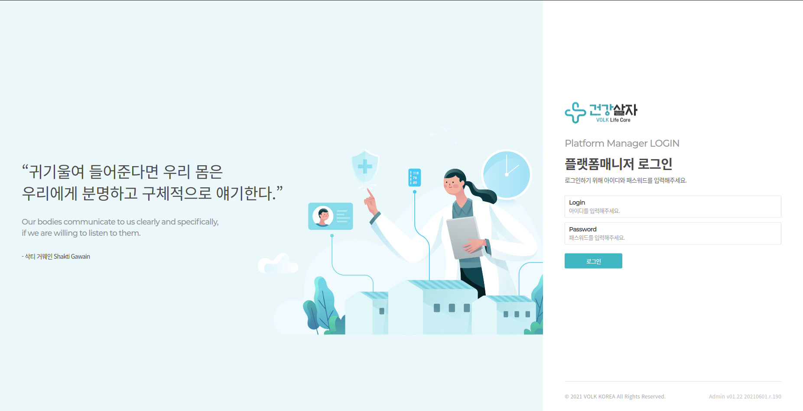
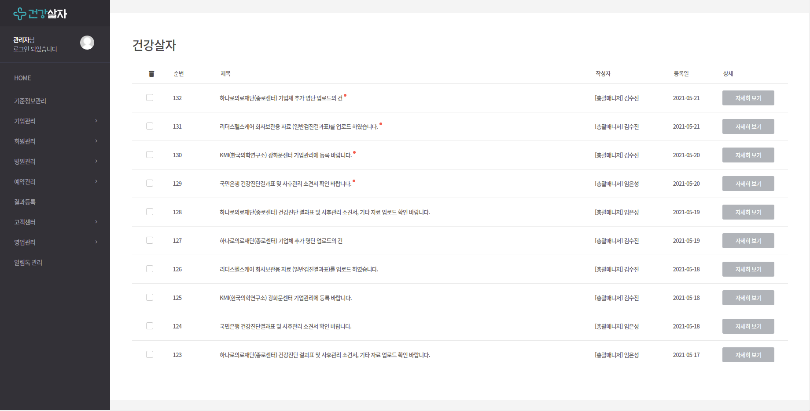

## 건강살자(GGSJ) 란?
기업 및 개인 고객을 대상으로, 검진 특성 및 개인 특성에 대한 고려
항목들을 반영한 건강검진 패키지 구성, 등록 설계를 진행하며,
알고리즘을 통한 예약 추천 / 예약 시스템을 개발 합니다.
고객의 니즈를 반영한 지속적 건강관리 및 검진 클러스터 구축을 목표로 하고 있습니다.



<br>

## 접속방법
- 정식 URL : http://ggsj.co.kr/ (오픈 예정)
- 개발 URL : http://110.165.17.99/pm/login

```
건강검진 메인 화면 입니다.
```


<br>

## DevTools
- 개발자용 개발환경 64bit(Implementation Tool) Version 3.10.0
  - eGovFrameDev-3.10.0
- JAVA 8 & SPRING
- TOMCAT 9.0.46
- JENKINS 2.277.4
- NAVER CLOUD PLATFORM DB
  - MYSQL 8.0.25

<br>

## License
건강살자(GGSJ)의 저작권은 (주)VOLK에 있습니다.


